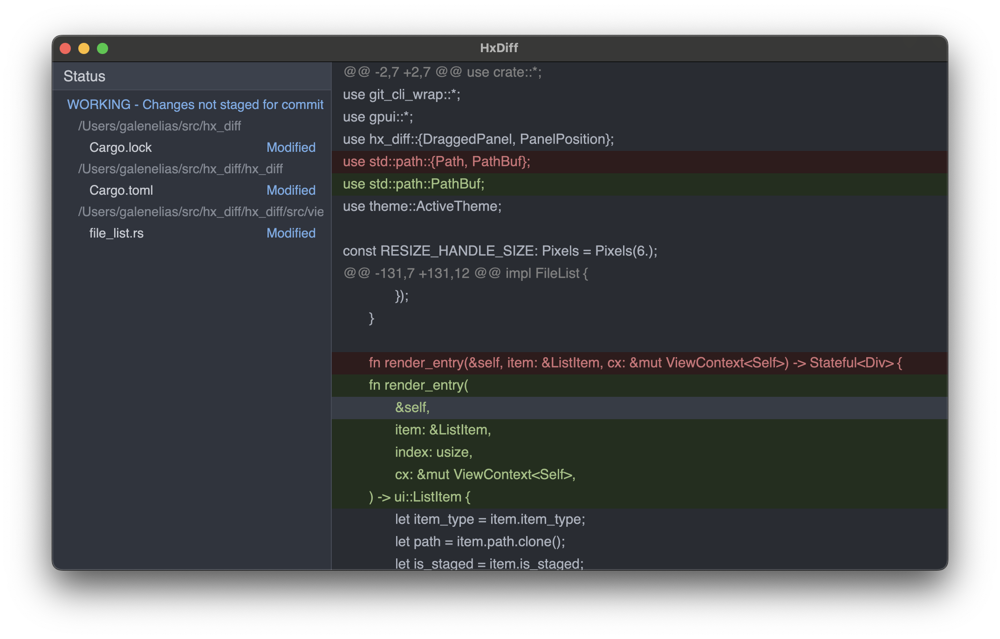

# HxDiff

HxDiff is a basic git aware diff tool built in Rust using [GPUI](https://gpui.rs). Fast and simple to use. Eventually cross platform.

This is currently a very rough work in progress and doesn't do anything useful yet.

